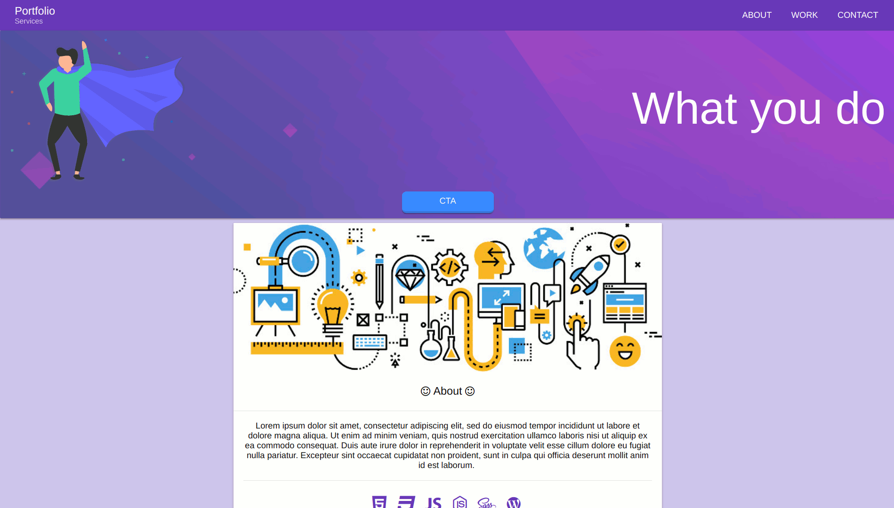

# Vue and Quasar Example Site

Example of a website built with Vue and Quasar Framework.




## Getting Started

These instructions will get you a copy of the project up and running on your local machine for development and testing purposes. See deployment for notes on how to deploy the project on a live system.

### Prerequisites

Have NPM and Node.js installed.

### Installing

A step by step series of examples that tell you have to get a development env running

```
git clone https://github.com/zutton/vue-example.git

cd vue-example
npm install
```

To get up in running use:

```
$ quasar dev
```
Available to view on ```http://localhost:8081```

## Deployment

how to deploy production build on a live system

```
$ quasar build
```

## Built With

* [Vue.js](https://vuejs.org/) - Vue (pronounced /vjuː/, like view) is a progressive framework for building user interfaces. 
* [Quasar Framework](http://quasar-framework.org/) - Vue Framework.

## Authors

* **Blake Sutton** 

## License

MIT License


# Quasar App

> A Quasar project

## Build Setup

``` bash
# install dependencies
$ npm install

# serve with hot reload at localhost:8080
$ quasar dev

# build for production with minification
$ quasar build

# lint code
$ quasar lint
```
